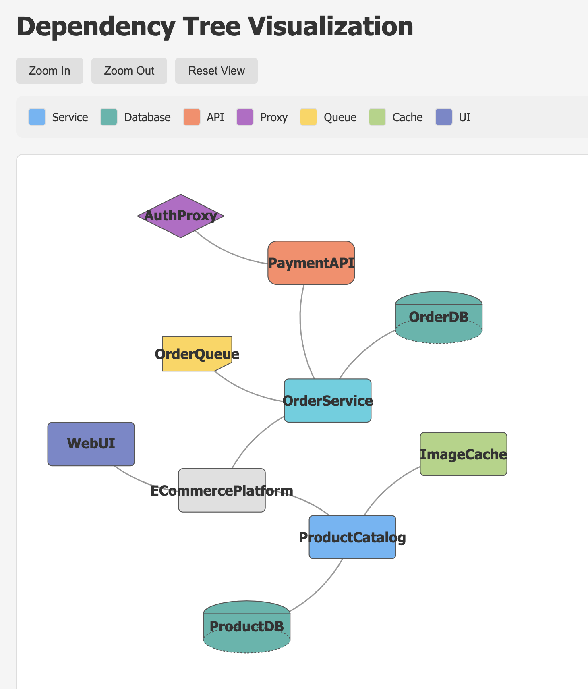

## Dependency Tree Visualization Tool

Here's a comprehensive solution that generates a visual dependency tree from JSON input using Python and Graphviz. This tool creates both interactive HTML and static image outputs.

## Solution Overview

- Python Script (dependency_visualizer.py) - Processes JSON input and generates visualization

- Example JSON Input (dependencies.json) - Sample dependency structure

- HTML Template (template.html) - For interactive visualization

## Installation and Usage

- Install dependencies:

```bash
uv init: Create a new Python project.
uv add: Add a dependency to the project.
uv init
uv add graphviz jinja2
pip install graphviz jinja2
- Run the visualizer:
- Generate interactive HTML visualization:
python3 dependency_visualizer.py dependencies.json -f html --open --theme dark
- Generate static PNG image:
python3 dependency_visualizer.py dependencies.json -f png --vertical
- Generate SVG for documentation:
python3 dependency_visualizer.py dependencies.json -f svg --output ecommerce_architecture
```

## Features

- Multiple Output Formats:

- Interactive HTML (D3.js)

- Static images (PNG, SVG, PDF, JPG)

- Visual Customization:

- Color coding by node type

- Vertical or horizontal layout

- Interactive tooltips

## Interactive HTML Features:

- Zoomable and draggable nodes

- Force-directed layout

- Detailed tooltips on hover

- Legend for node types

## Command Line Options:

- Specify input/output files

- Choose output format

- Control layout orientation

- Auto-open after generation

- NOTE: This tool provides a comprehensive solution for visualizing dependency trees from JSON input with both interactive and static output options.

## Demo-Visualization:


